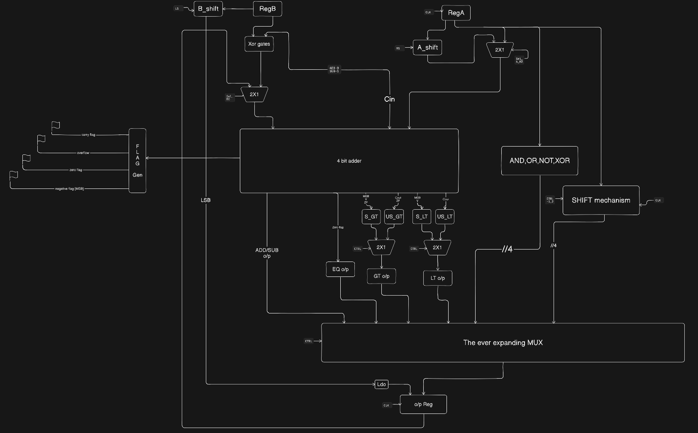
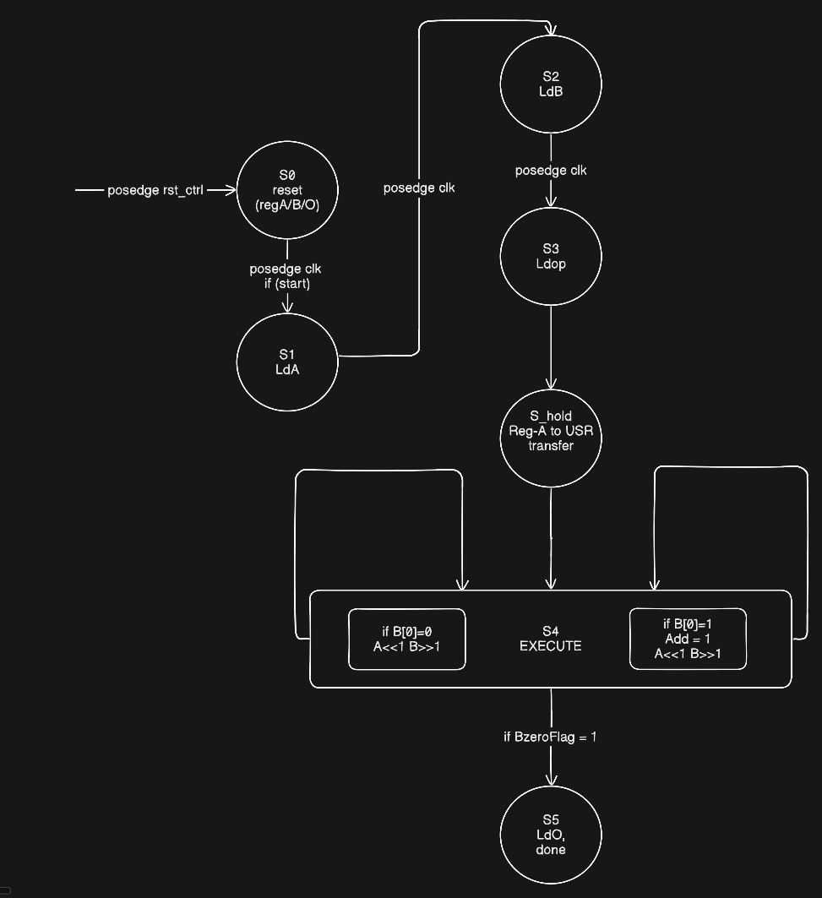
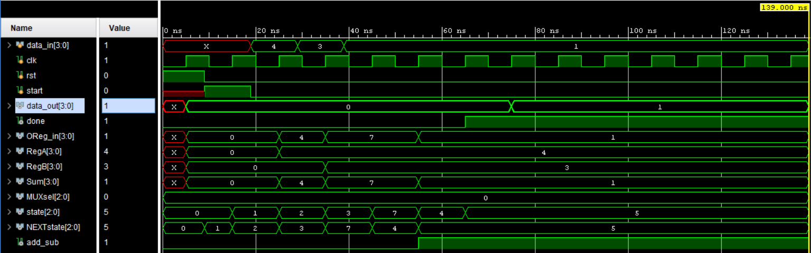
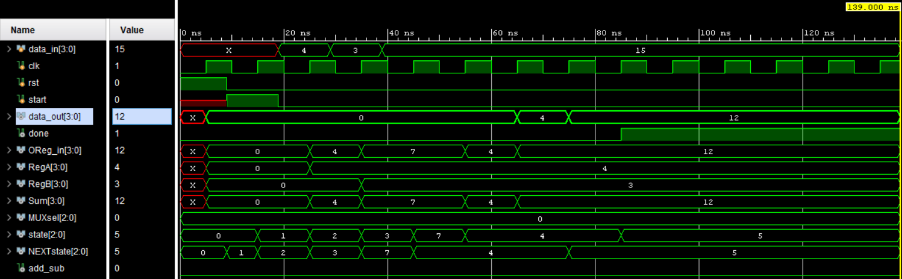
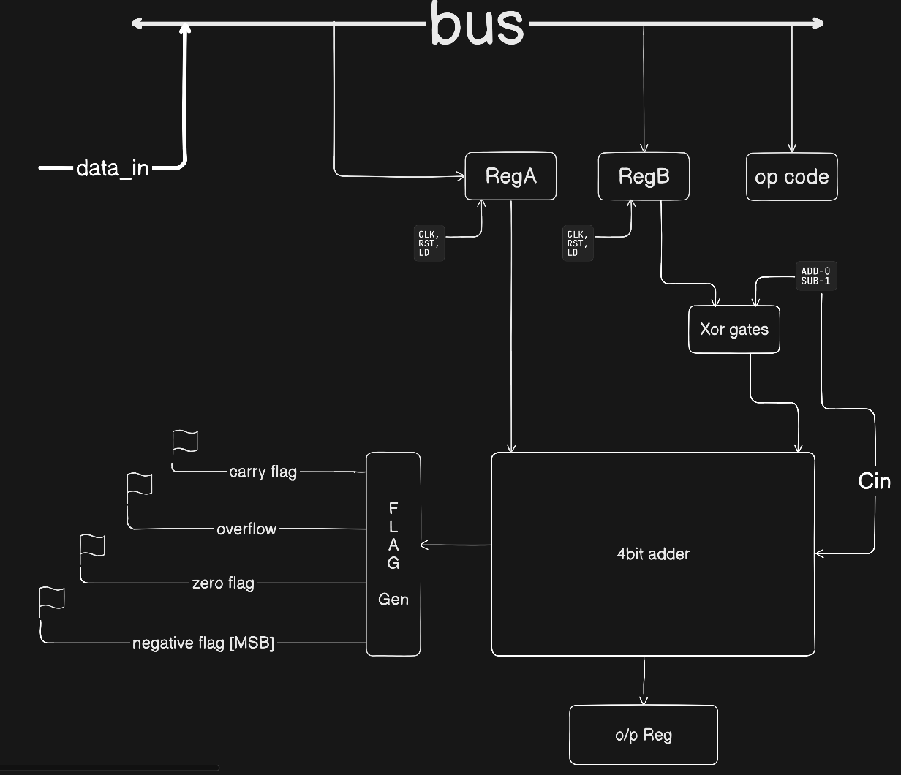
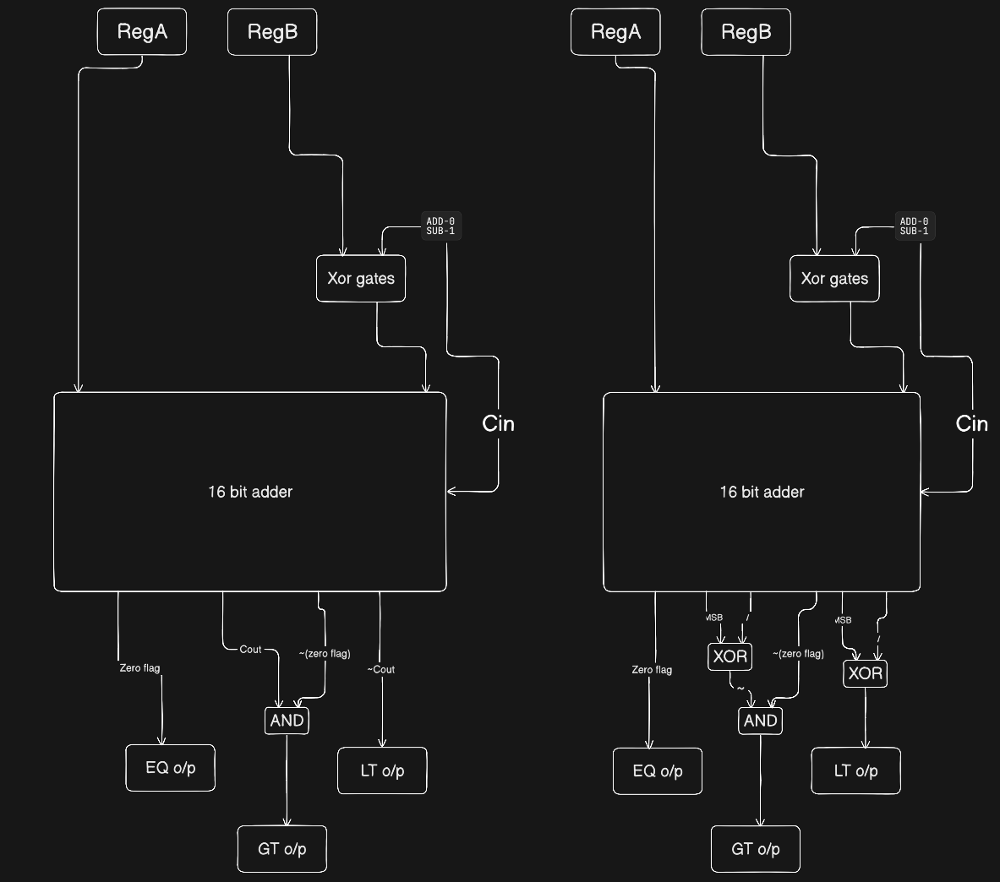
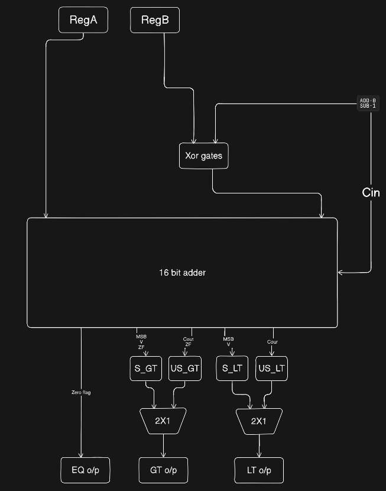
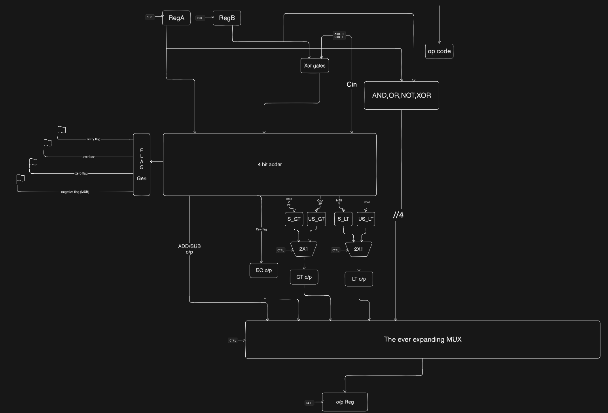
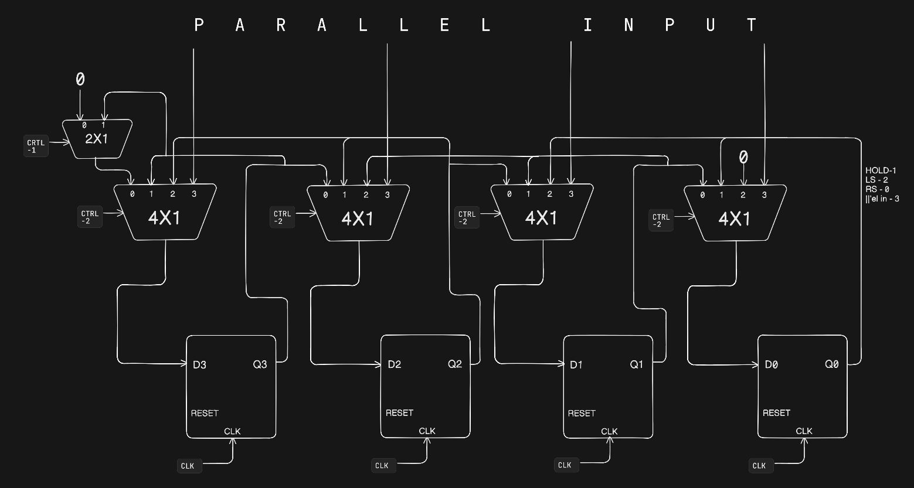

# Multicycle ALU Design in Verilog

##  Overview
This project implements a **4-bit multicycle ALU** using a **controller–datapath architecture**.  
Operations are executed across multiple clock cycles using an **FSM-based controller**.
This design demonstrates multicycle execution, hardware reuse, and control–datapath separation.

The design supports:
- Arithmetic operations
- Logical operations
- Shift operations
- Comparison operations
- Iterative unsigned multiplication using the **shift-add algorithm**

---

##  Architecture

The design is divided into two main components:

- **Datapath**: Registers, ALU, shifter, and multiplexers  
- **Controller**: Finite State Machine (FSM) generating control signals  

---

##  Design Diagrams

### Datapath

### FSM

---
##  Simulation

Representative waveforms demonstrating key operations:

---

### SUB Operation

---

### SRL (Shift Right Logical)

---

### UMUL (Unsigned Multiplication)

The UMUL waveform highlights the multicycle behavior:
- Iterative shift-add execution across states  
- `AMout` shifts left and `BMout` shifts right  
- Accumulation occurs based on `LsbB`  
- `Bzflag` indicates loop termination  

##  Datapath Evolution

The datapath was developed incrementally:

1. Initial design with input/output registers and adder  
2. Addition of logical operations  
3. Integration of shift unit  
4. Extension to support iterative multiplication  

---

##  Supported Operations

### Arithmetic
- ADD  
- SUB  

### Logical
- AND  
- OR  
- XOR  
- NOT  

### Comparison
- Signed comparison  
- Unsigned comparison  

### Shift Operations
- SRL (Shift Right Logical)  
- SLL (Shift Left Logical)  
- SRA (Shift Right Arithmetic)  

### Multiplication
- Iterative unsigned multiplication using shift-add  

---

##  FSM Behavior

The controller operates through the following states:

- **S0**: Reset  
- **S1–S3**: Load operands and opcode  
- **S_hold**: Stabilization of loaded data  
- **S4_1**: Execution of selected operation  
- **S5**: Write-back and completion  

---
##  Debugging & Design Challenges

These issues were encountered during development and highlight key hardware design considerations such as timing alignment and controller–datapath synchronization.

---

### 1. Unstable Control Signal Affecting Datapath Output

The control signal `add_sub` was generated as a combinational output from the controller and was only valid during the execution state (S4). However, the datapath output (`Sum`) is also combinational, while the final result is latched into the output register during the subsequent state (S5).

As a result, `add_sub` reverted to its default value in S5 before the output was captured. This caused the ALU to perform a different operation than intended, leading to incorrect results.

#### Fix
The control signal was ensured to remain stable across both execution and write-back stages. This was achieved by holding or registering the control signal so that the datapath computation remains valid until the result is latched.

---

### 2. FSM Reading Stale Opcode Due to Register Timing

The FSM evaluates `OPcode` in state S3 to determine the next state, while the datapath attempts to load a new opcode into `RegOP` during the same cycle.

Since `RegOP` is a clocked register, it updates only on the rising edge of the clock. However, the FSM’s next-state logic is combinational and evaluates before this clock edge. Consequently, the FSM reads the previous (stale) opcode value instead of the newly loaded one.

This leads to incorrect state transitions, as the decision logic operates on outdated information.

#### Fix
An intermediate wait state (`S_hold`) was introduced between loading the opcode and evaluating it. This provides one full clock cycle for the register to update, ensuring that the FSM operates on the correct and stable opcode value.
